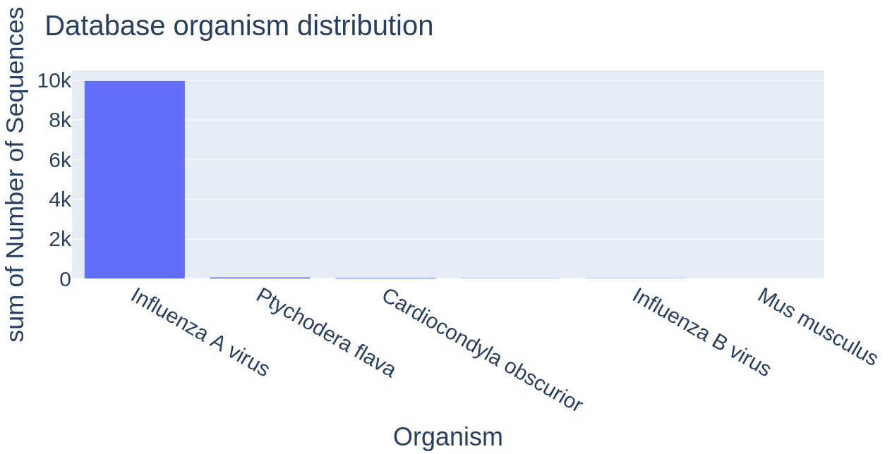
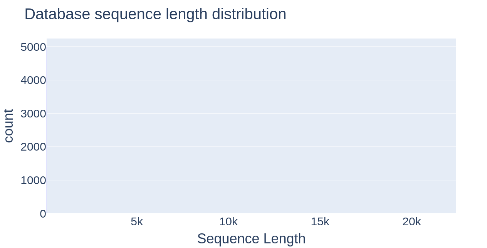
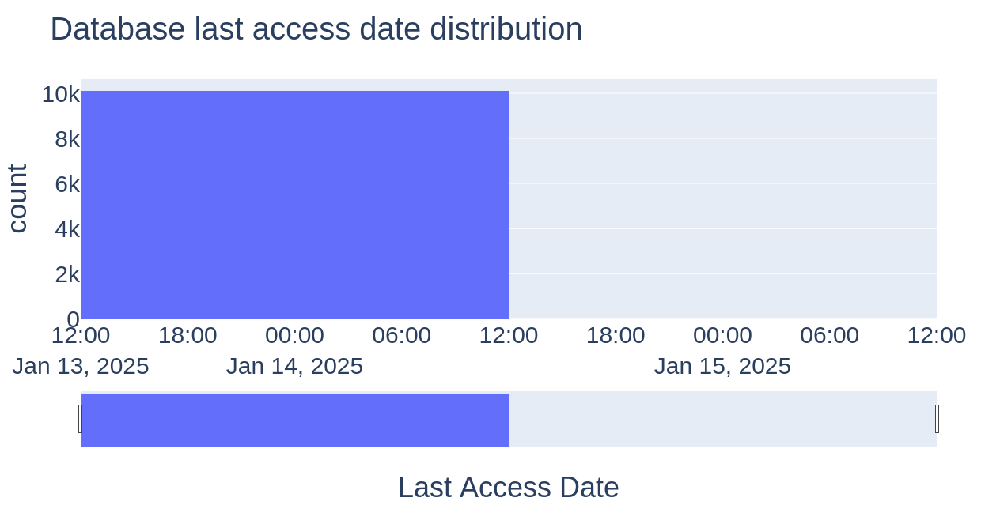
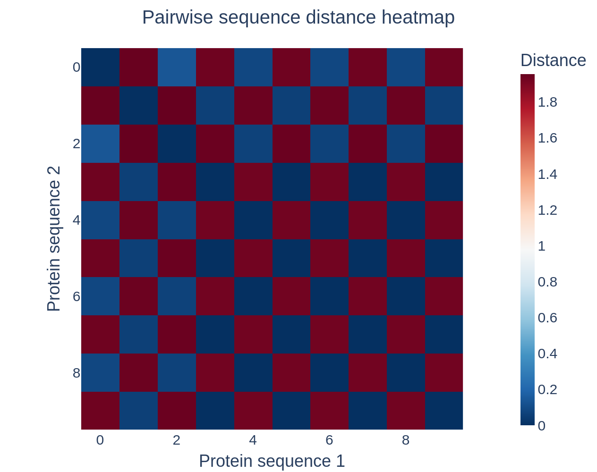

# ProteinTool - Инструмент для анализа белковых последовательностей

Мы часть бывшей команды Международного турнира естественных наук, где сталкивались с разными задачи биологического и физико-химического профиля прикладного характера. Все трое работаем в фармацевтической отрасли в крупных компаниях и давно интересуемся этой областью.

Мы решили помочь себе и коллегам и разрабатываем инструмент для поиска информации о них в базе NCBI (National Center for Biotechnology Information) и анализа белковых последовательностей.

## Наши преимущества

* Поиск данных сразу в базе NCBI - нет необходимости делать это самостоятельно и рыться в сотнях файлов
* Результаты поиска сохраняются в локальной базе данных
* Множественное выравнивание белковых последовательностей - удобная визуализация
* Подсчёт матрицы попарных расстояний между последовательностями - полезная информация для обработки данных
* Фильтрация выбросов в данных по длине последовательностей - долой мусорные последовательности
* Сохранение отфильтрованных данных для дальнейшей работы - можно поделиться данными с коллегами
* Не требуется установка сторонних программ - всё работает благодаря нескольким самым популярным python пакетам;
* Не требует долгой установки и настройки

## Структура проекта

* `config.py` - модуль с конфигурацией проекта;
* `dashboard.py` - модуль для визуализации дашборда;
* `database.py` - модуль для работы с базой данных белковых последовательностей;
* `db_model.py` - модуль для объявления структуры базы данных белковых последовательностей;
* `main.py` - основной модуль проекта. Осуществляет взаимодействие с пользователем, обработку ввода и сохранение результатов работы;
* `protein.py` - модуль для анализа белковых последовательностей. Содержит функции для поиска белковых последовательностей в базе NCBI, множественного выравнивания последовательностей и фильтрации последовательностей по их длине;
* `plot_alignment.py` - модуль для визуализации множественного выравнивания последовательностей аминокислот в виде цепочек цветных геометрических фигур;
* `utils.py` - модуль со вспомогательными утилитами.

### Дополнительные файлы

* `alignment.fasta` - пример файла с выравниванием для отрисовки
* `distance_matrix.csv` - пример файла с матрицей расстояний для отрисовки
* `protein_sequences.db` - пример базы данных
* `./images` - примеры изображений из дашборда

## Запуск проекта

1. Установить необходимые пакеты:
    * `biopython` - для работы с базой NCBI
    * `biotite` - для множественного выравнивания
    * `dash`, `dash-bio` - для визуализации дашборда в целом и белковых последовательностей
    * `numpy` - для быстрых расчётов
    * `matplotlib` - для визуализации
    * `pandas` - для работы с табличными данными
    * `plotly` - для визуализации отдельных графиков
    * `sqlalchemy` - для работы с базой данных SQL
2. Перейти в папку с исходными файлами проекта
3. Запустить поиск данных. Для этого в командной строке выполнить:

    ```console
    python ./main.py
    ```

4. Если всё запустилось корректно, то вы увидите сообщение `Enter your NCBI database search query:`
5. Ввести свой запрос. Будет выполнено обновление локальной базы данных в файле `protein_sequences.db`, если он есть, иначе файл будет создан.
6. Для визуализации дашборда по найденным данным выполнить:

    ```console
    python ./dashboard.py
    ```

    Далее следовать указаниям в командной строке - по умолчанию визуализация дашборда должна открываться в браузере [по этой ссылке](http://127.0.0.1:8050/).

7. Использовать проект на благо науки

## Примеры графиков из визуализации дашборда и выводов, которые по ним могут быть сделаны

### График распределения количества записей в базе данных по организмам



Можно заметить некоторое количество (порядка 20) записей, у которых название организма - пустая строка. Вероятнее всего это связано с отсутствием данных.

Также заметно преобладание Influenza A virus, поскольку в тестовую базу данных добавлено порядка 10000 записей по запросу "Influenza A matrix protein"

### График распределения количества записей в базе данных по длине последовательности



Заметны два пика, которые соответствуют большому числу последовательностей с малой длиной (2 типа белка Influenza A matrix protein - см. предыдущий и следующий пункты)

### График распределения количества записей в базе данных по дате последнего обращения



Хорошо заметен пик на 14.01.2025 и малое количество на 15.01.2025 (второй день был добавлен для демонстрационных целей)

### Теловая карта попарных расстояний между последовательностями



Исследовалась выборка из 10 последовательностей Influenza A matrix protein. По визуализации можно сделать вывод о наличии двух групп схожих между собой последовательностей, причём эти группы сильно отличаются друг от друга. Так и оказалось - это два разных типа белка с разной длиной последовательности.

## Наши планы на будущее

* Поиск консенсусной белковой последовательности (белок, наиболее похожий на все остальные);
* Фильтрация выбросов по похожести на консенсусную последовательность (выбрасывать слишком отличающиеся белки);
* Для консенсусной последовательности добавить расчёт и вывод данных изоэлектрической точки и молекулярной массы белка;
* Улучшить внешний вид визуализации множественного выравнивания
* Работа над интерфейсом программы для Windows?
